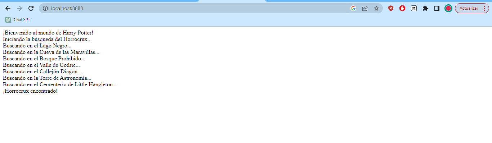

# Asíncrono en Python

## Librerías `Threading` y `Asyncio`.

En el primer ejemplo se utiliza la librería `threading` de Python para crear dos hilos, uno para cada personaje, y lanzar los hechizos de manera paralela. La clase `LanzamientoDeHechizo` extiende la clase `Thread` y sobrescribe el método `run()` para definir la tarea que se ejecutará en el hilo. El método `time.sleep()` se utiliza para simular el tiempo que tarda en lanzar el hechizo. Luego, se inician los dos hilos con `duelo1.start()` y `duelo2.start()` y se espera a que terminen con `duelo1.join()` y `duelo2.join()`.

En el segundo ejemplo se utiliza la librería `asyncio` de Python para crear tareas asícronas. Se definen dos funciones asínronas `buscar_hogwarts()` y `estudiar()` que utilizan la palabra clave `async` y `await` para indicar que esperarán a que se complete una operación de entrada/salida. Luego, se crea la función `main()` que crea dos tareas con `asyncio.create_task()` y espera a que ambas se completen con `await tarea1` y `await tarea2`. Finalmente, se ejecuta la función `main()` con `asyncio.run(main())`.

## Librería `Twisted`.
Antes de empezar, hay que instalar la librería de la siguiente forma:
```
pip install twisted
```
Este código utiliza la biblioteca Twisted de Python para implementar un servidor asíncrono. Twisted es un framework de red para Python que se enfoca en la programación asíncrona, lo que significa que el servidor puede manejar múltiples conexiones simultáneamente sin bloquearse en operaciones de entrada/salida.

El código define dos clases: `HarryPotterProtocol` y `HarryPotterFactory`. `HarryPotterProtocol` define el comportamiento del protocolo que se utilizará para comunicarse con los clientes que se conectan al servidor. Cuando se establece una nueva conexión, se llama a `connectionMade()`, que envía un mensaje de bienvenida al cliente y solicita su nombre. Luego, cuando se recibe un mensaje de datos del cliente, se extrae el nombre, se envía otro mensaje de bienvenida y se cierra la conexión.

`HarryPotterFactory` define cómo se crean nuevas instancias de `HarryPotterProtocol`. En este caso, simplemente devuelve una nueva instancia de `HarryPotterProtocol` cada vez que se llama a `buildProtocol()`.

Finalmente, se llama a `reactor.listenTCP()` para iniciar el servidor en el puerto 8000 y se llama a `reactor.run()` para iniciar el bucle de eventos del reactor de Twisted, que es lo que permite que el servidor maneje múltiples conexiones simultáneamente sin bloquearse. El bucle de eventos escucha y procesa las conexiones entrantes, y llama a los métodos correspondientes de la clase `HarryPotterProtocol` para manejar la comunicación con los clientes.

## Librería `Tornado`.
Antes de empezar, hay que instalar la librería de la siguiente forma:
```
pip install tornado
```
Este código utiliza la biblioteca Tornado de Python para implementar una aplicación asincrónica utilizando funciones y métodos asincrónicos. El bucle principal de eventos se maneja mediante el uso de `tornado.ioloop.IOLoop.current().start()`. Esto permite que la aplicación se ejecute de forma asíncrona y responda a las solicitudes de forma no bloqueante. 

El decorador `@asyncio.coroutine` se utiliza para definir funciones asincrónicas. En este código, se usa la palabra clave `async` para definir métodos y funciones asincrónicos en lugar de `@asyncio.coroutine`. La función `get` de la clase `MainHandler` es asincrónica y utiliza la palabra clave `async` antes de la definición del método. 

La función `run_in_executor` de la biblioteca Tornado se utiliza para ejecutar funciones no bloqueantes en un bucle de eventos. En este caso, se usa la función `time.sleep(1)` dentro del método `sleep` para pausar la ejecución de la búsqueda del Horrocrux durante 1 segundo sin bloquear el bucle principal de eventos. 

A contuación se muestra la imagen del resultado de la ejecución del programa:



